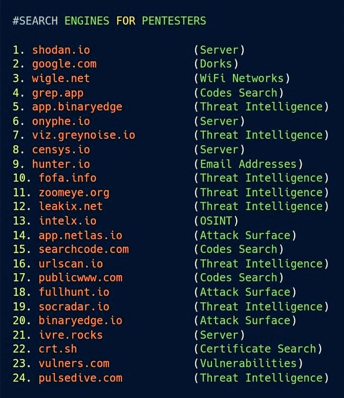

# OSINT

https://www.cisa.gov/publication/stuff-off-search

## IP Address

https://ipinfo.io/

https://www.maxmind.com/en/home

https://www.ipvoid.com/

https://whois.ipinsight.io/

## Domain

https://www.urlvoid.com/

https://securitytrails.com/dns-trails

https://www.domcop.com/top-10-million-websites

https://hackertarget.com/top-million-site-list-download/

https://www.v2.openresolver.jp/

https://dnslytics.com/

## SubDomain

https://subdomainfinder.c99.nl/

## URL

https://www.getlinkinfo.com/

https://www.expandurl.net/

https://lab.syncer.jp/Tool/URL-Checker/

https://securl.nu/

https://re.i0.pt/

## Tools

https://github.com/robertdavidgraham/masscan

https://sqlmap.org/

https://openvas.org/

https://wpscan.com/

https://github.com/CoolerVoid/0d1n

https://github.com/jivoi/awesome-osint

https://toolbox.google.com/factcheck/explorer
